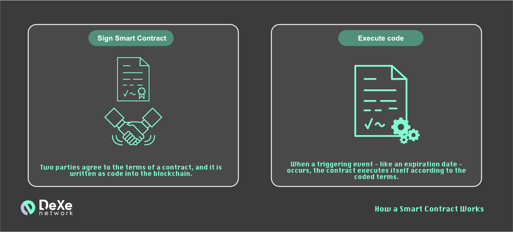

# DeXe Documentation.Smart Contracts

*Dexe.network* or *Dexe* (Decentralized Social Trading Platform) – is an online, decentralized and autonomous cryptocurrency assets portfolio environment which operates via autonomous *Smart Contracts*, that includes tools for virtual currency allocation, automatic rebalancing. It eliminates the risks of transferring digital wallet details, such as private keys and API or any virtual currency data to a third party, as well as fixing the absence of decentralized interconnection ​between users and successful traders within the mainet.

*Dexe* based on *Uniswap* computing platform. It provides *Smart Contract* system to buissnes and social cooperation. Thus programmers can coding *Smart Contracts* to be automatically executed according to their program algorithm, when the requirements are appeared.

A *Smart Contract* is a computer program or a transaction protocol which is intended to automatically execute, control or document legally relevant events and actions according to the terms of a contract or an agreement. The objectives of smart contracts are the reduction of need in trusted intermediators, arbitrations and enforcement costs, fraud losses, as well as the reduction of malicious and accidental exceptions.

<!-- 
~~*Smart Contracts* are applications that run on the Ethereum Virtual Machine. This is a decentralized “world computer”, where the computing power is provided by all those Ethereum nodes. Any nodes providing computing power are paid for that resource in Ether tokens.~~ -->

*Smart contracts* can be used for many different things. Developers can create smart contracts that provide features to other smart contracts, similar to how software libraries work. Or smart contracts could simply be used as an application to store information on the Ethereum blockchain.

The best way programming Contracts is *Solidity*, a *Javascript*-like language developed specifically for writing *Smart Contracts*.

<!-- ~~They’re named smart contracts because you can write “contracts” that are automatically executed when the requirements are met.~~ -->

*DeXe mainnet*  is a binary *Smart Contract* system. Core contracts provide fundamental safety guarantees for all parties interacting with *Uniswap* farmework. Periphery contracts interact with one or more core contracts, but are not themselves part of the core.
*Uniswap* uses liquidity pools rather than serving as market maker, also in contrast to centralized exchanges, with an aim to create more efficient markets. Users provide liquidity to the exchange by adding a pair of tokens to a smart contract which can be bought and sold by other users. In return, liquidity providers are given a percentage of the trading fees earned for that trading pair. For each trade a certain amount of tokens are removed from the pool for an amount of the other token, thereby changing the price. No fees are required to list tokens which allows a large amount of Ethereum tokens to be accessible and no registration is required for users.

Thus *DeXe* which based on *Uniswap* are designed to let people lend, borrow, trade and take out insurance directly from each other, without use of intermediaries such as banks.

## Core
<!---Source code--->
The core consists of a singleton factory and many pairs, which the factory is responsible for creating and indexing. These contracts are quite minimal. The simple rationale for this is that contracts with a smaller surface area are easier to reason about, less bug-prone, and more functionally elegant. Perhaps the biggest upside of this design is that many desired properties of the system can be asserted directly in the code, leaving little room for error. One downside, however, is that core contracts are somewhat user-unfriendly. In fact, interacting directly with these contracts is not recommended for most use cases. Instead, a periphery contract should be used.

### Factory

<!--Reference documentation--->
The factory holds the generic bytecode responsible for powering *pairs*. Its primary job is to create one and only one smart contract per unique token *pair*. It also contains logic to turn on the protocol charge.
<!--
Factory pattern is to be used for one of the following reasons:
* If you want to create multiple instances of the same contract and you’re looking for a way to keep track of them and make their management easier.
* Save gas on deployment: You can deploy only the factory and use it later to deploy the other contracts.
* Improve contract security
* Simplify way for users or yourself to deploy contracts.
-->

### Pairs

<!--Reference documentation-->
<!--Reference documentation (ERC-20)-->
Pairs are assets that can be traded for each other on an exchange. 
Decentralized application allows users to swap tokens and add liquidity into the pools that make swaps possible. Swaps on are done between **pairs**: two tokens that you can swap between, such as the USDC/ETH pair. Users can swap between these pairs (USDC for ETH, or ETH for USDC). Each pair is enabled by a **Pool** which contains a quantity of both tokens (USDC tokens and ETH tokens in our example). Users can choose to contribute to the pool if they want to enjoy fees that swapping users must pay.
Pairs have two primary purposes: serving as automated market makers and keeping track of pool token balances. They also expose data which can be used to build decentralized price oracles.

## Periphery

The *Periphery* is a constellation of Smart Contracts designed to support domain-specific interactions with the core. Because of *Uniswap*’s permissionless nature, the contracts described below have no special privileges, and are in fact only a small subset of the universe of possible periphery-like contracts. However, they are useful examples of how to safely and efficiently interact with DeXe.Network.

The *Periphery* extends smart contracts funtionality using external contracts. They are not required for *Uniswap* to exist. New periphery contracts can always be deployed without migrating liquidity.

[Examples of the open source *Periphery* of Uniswap](https://awesomeopensource.com/project/Uniswap/uniswap-v2-periphery)

### Library

<!--Reference documentation-->
The *Library* is a collection of special internal functions used by DeXe.Network which add special functionality to platform. The library provides a variety of convenience functions for fetching data and pricing.

Library is an isolated piece of source code, it can only access state variables of the calling contract if they are explicitly supplied (it would have no way to name them, otherwise). Library functions can only be called directly. 

### Router

<!--Reference documentation-->
The *Router* uses the library. It fully supports all the basic requirements of a front-end offering trading and liquidity management functionality. It natively supports multi-pair trades (e.g. `x` to `y` to `z`), treats *ETH* as a first-class citizen, and offers meta-transactions for removing liquidity.

--
## Design Decisions

The following sections describe some of the notable design decisions made in *Uniswap* V2. 
> These are safe to skip unless you’re interested in gaining a deep technical understanding of how V2 works under the hood, or writing smart contract integrations!

### ERC-20

ERC (Ethereum Request for Comments) is the official protocol for making proposals for improving the Ethereum network; 20 - unique identification number of the offer.

Recently, one of the most common methods of raising funds for the launch and development of projects in the cryptocurrency industry has become the so-called initial coin offerings (*ICO*). Most *ICOs* use the Ethereum network as a platform, or more precisely, the smart contracts of this network. When conducting fundraising campaigns, *ICO* organizers usually accept *ETH* or *BTC* as payment, crediting investors in exchange for tokens. Most often these are *ERC-20* tokens.

Tokens that meet these specifications are known as *ERC-20* tokens and are effectively smart contracts on the Ethereum blockchain. Despite the fact that *ERC-20* tokens operate within the framework established by the Ethereum team, this framework is wide enough to provide developers with a lot of flexibility when creating them.

ERC-20 has emerged as the technical standard; it is used for all smart contracts on the Ethereum blockchain for token implementation and provides a list of rules that all Ethereum-based tokens must follow.

The *ERC-20* standard defines a set of rules that must be followed in order for a token to be accepted and to be able to interact with other tokens on the network. Tokens themselves are blockchain assets that can have value and can also be sent and received like any other cryptocurrency.

The difference between *ERC-20* tokens and other well-known cryptocurrencies, for example, Bitcoin or Litecoin, is that they are tied to the Ethereum network, use the address format accepted within this network, and are sent using Ethereum transactions. Accordingly, transactions involving *ERC-20* tokens can be tracked in the block explorer.

### Sending Tokens

Smart contracts which need tokens to perform some functionality require would-be interactors to first make an approval on the token contract, then call a function that in turn calls transfer from on the token contract. This is *not* how V2 pairs accept tokens. Instead, pairs check their token balances at the end of every interaction. Then, at the beginning of the next interaction, current balances are differenced against the stored values to determine the amount of tokens that were sent by the current interactor. See the [whitepaper](https://uniswap.org/whitepaper.pdf) for a justification of why this is the case, but the takeaway is that tokens must be transferred to the pair before calling any token-requiring method (the one exception to this rule is *Flash Swaps*).

### WETH

The *WETH* digital coin was launched by *Radar Reley*, a decentralized exchange that buys and sells tokens issued on the *ERC20* standard, which is the internal currency and exchange counterpart of *Ethereum*.

The need for WETH appeared as it correspond to the *ERC20* standard  unlike *Ether* itself does not correspond to it, since it appeared much earlier.
Thus this discrepancy leads to the risk of losing tokens when trying to use *Ethereum* to trade on decentralized exchanges directly. *WETH* is an *Ether* conversion for *ERC20* compliance. Accordingly, the WETH rate is pegged to the *ETH* rate at a 1 to 1 ratio.
<!--WETH is wrapped ETH (Ether).-->
Unlike Uniswap V1 pools, V2 pairs do not support ETH directly, so ETH⇄ERC-20 pairs must be emulated with WETH. The motivation behind this choice was to remove ETH-specific code in the core, resulting in a leaner codebase. End users can be kept fully ignorant of this implementation detail, however, by simply wrapping/unwrapping ETH in the periphery.

The *Router* fully supports interacting with any *WETH* pair via *ETH*.

### Minimum Liquidity

To ameliorate rounding errors and increase the theoretical minimum tick size for liquidity provision, pairs burn the first `MINIMUM_LIQUIDITY` pool tokens. For the vast majority of pairs, this will represent a trivial value. The burning happens automatically during the first liquidity provision, after which point the *totalSupply* is forevermore bounded.
