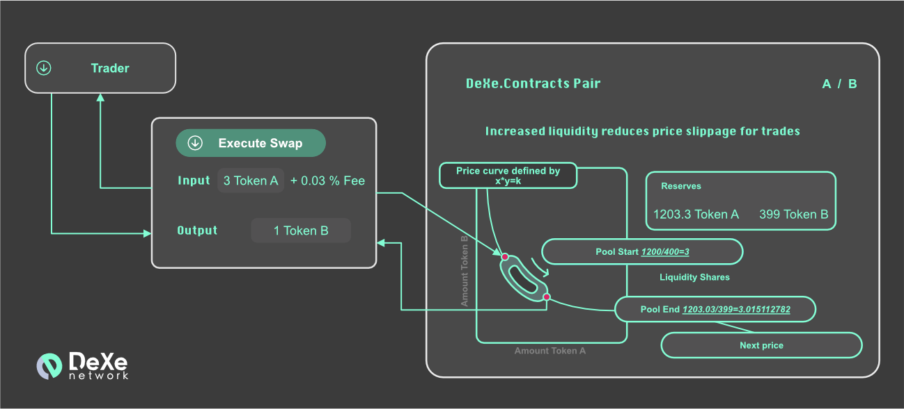

# DeXe Documentation.Swaps



## Introduction

The *Uniswap* as part of DeXe platform operates swap functions on the general base.
The *Uniswap* token swap is an easy way to exchange one *ERC-20* token for another. For end-users, swapping is intuitive proces, so it happens invisibly for them. The swapping process occurs according to the procedure, when the user firstly selects the input token, and then gets the output token. Thus, the user specifies the input amount. Then the protocol calculates how much output token he will receive. The user performs a one-click swap, immediately receiving the output token into his wallet. 
This section indicates the process of exchanging tokens at the protocol level. Swaps in *Uniswap* differ from trades on traditional platforms. *Uniswap* does not use the order book to represent liquidity or determine prices. *Uniswap* uses an automated market maker mechanism for instant feedback on rates and slippage. Each pair on *Uniswap* is actually supported by a pool of liquidity. Liquidity pools are smart contracts that contain a balance of two unique tokens and ensure compliance with the rules of deposit and withdrawal. This rule is a permanent product formula. When one of the tokens is withdrawn (bought), a proportional amount of the other must be deposited (sold) to maintain a constant value. 


## Anatomy of a swap

At the most basic level, all swaps in Uniswap V2 happen within a single function, aptly named swap:

```solidity
function swap(uint amount0Out, uint amount1Out, address to, bytes calldata data);
```

## Receiving tokens

*Uniswap* requires `swap` callers to specify how many output tokens they would like to receive via the `amount{0,1}` Out parameters, which correspond to the desired amount of `token{0,1}`.

## Sending Tokens

According to common practice and technology, *Smart contracts*, that use tokens to perform some functions, so firstly they require callers to  approve the token contract and then call a function, which in turn will call `transferFrom` in the token contract. Pairs in the V2 version interact with tokens in a different way. They first check the balance of their tokens at the end of each interaction. Then, at the start of the next interaction, the current balances are compared with the stored values ​​to determine the number of tokens sent by the current interactor.

Tokens must be transferred to pairs before calling the swap function (the only exception to this rule is `Flash Swap`). This means that in order to use the swap function safely, it must be called from another smart contract.

An alternative operation (transfer of tokens in a pair followed by a swap call) is unsafe non-atomic, since in this case the sent tokens will be vulnerable to arbitration.

--


## Developer resources

- To see how to implement token swaps in a smart contract read Trading from a [smart contract](https://uniswap.org/docs/v2/smart-contract-integration/trading-from-a-smart-contract/).

- To see how to execute a swap from an interface read [Trading (SDK)](https://uniswap.org/docs/v2/javascript-SDK/trading/)
